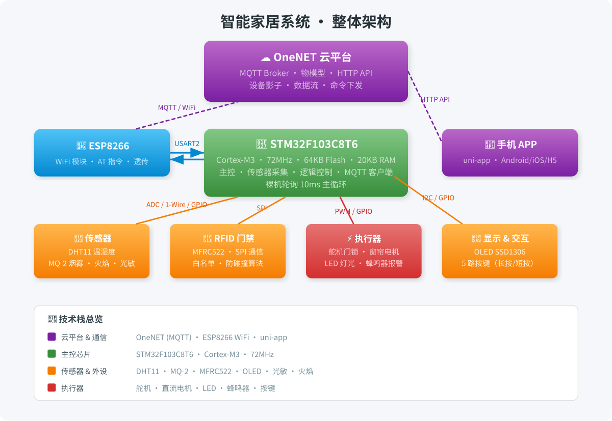
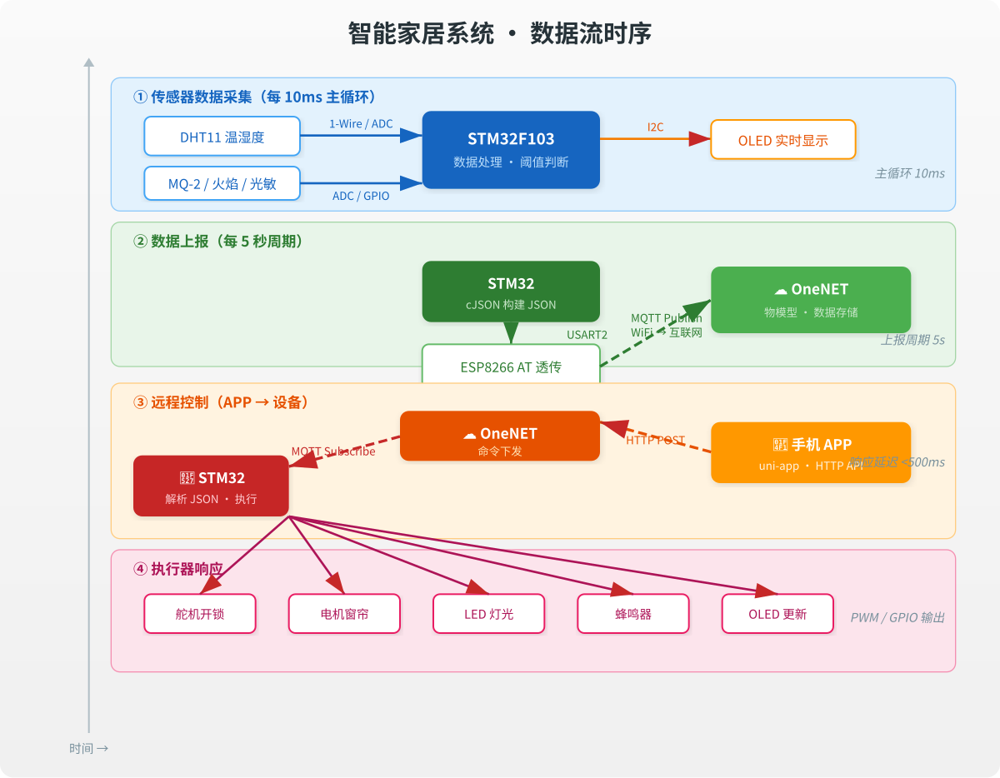
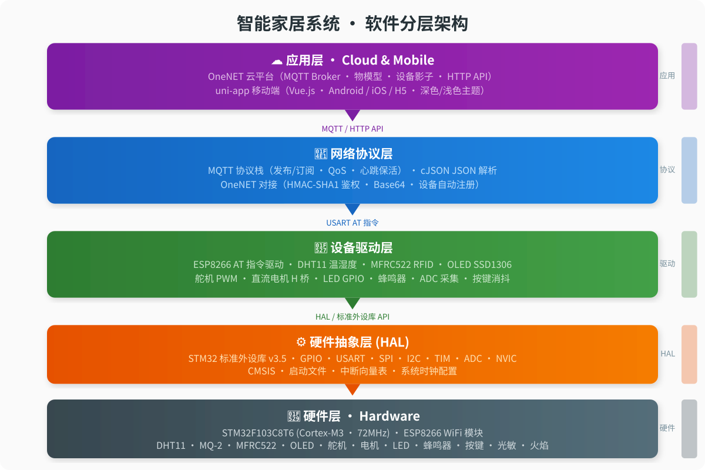

markdown
markdown
# 🏠 STM32 智能家居物联网系统

[](LICENSE)
[]()
[-green.svg)]()
[]()

> 基于 STM32F103 + ESP826 + OneNET 云平台的全栈智能家居系统，涵盖嵌入式固件开发、物联网通信协议、云端对接、移动端 APP 开发完整链路。

📹 **演示视频**：[B站完整演示](https://www.bilibili.com/video/BV1oF9XBrEmL/?vd_source=ecd48a869e2adad0265fa57f5a0e836)

---

## 📐 系统架构

### 整体架构图



### 数据流方向



### 软件分层架构



---

## 🔧 技术选型及理由

### 1. 主控芯片：STM32F103C8T6

| 对比项 | STM32F103C8T6 | ESP32 | STC89C52 |
|--------|---------------|-------|----------|
| 主频 | 72 MHz | 240 MHz | 12 MHz |
| Flash / RAM | 64KB / 20KB | 4MB / 520KB | 8KB / 512B |
| 外设丰富度 | SPI×2, I2C×2, USART×3, ADC×2, TIM×4 | WiFi/BT 内置 | 极少 |
| 生态 | CubeMX + HAL + 巨大社区 | Arduino/IDF | 过时 |
| 成本 | ¥6-8 | ¥12-15 | ¥3-5 |

**选型理由**：
- STM32F103 是嵌入式行业入门标杆，面试官最熟悉的芯片，简历可读性高
- 外设资源足够覆盖本项目所有传感器（SPI 接 RFID、I2C 接 OLED、USART 接 ESP8266）
- 72MHz Cortex-M3 内核对于传感器采集 + 网络通信绰绰有余
- 价格低廉，适合学习和原型验证

### 2. 通信方案：ESP826 + MQTT 协议

**为什么选 ESP8266 而不是内置 WiFi 的 ESP32？**
- 体现 **MCU + 独立 WiFi 模块** 的经典架构，更贴近工业产品实际方案（模块化设计，便于替换升级）
- 学习 AT 指令集交互方式，理解串口通信底层机制
- STM32 负责业务逻辑，ESP8266 仅负责网络透传，职责分离

**为什么选 MQTT 而不是 HTTP？**

| 对比项 | MQTT | HTTP |
|--------|------|
| 连接方式 | 长连接 | 短连接（每次新建） |
| 协议开销 | 2 字节最小包头 | 几百字节头部 |
| 实时性 | 毫秒级推送 | 需轮询 |
| 功耗 | 低（心跳保活） | 高（频繁建连） |
| 适用场景 | IoT 双向通信 | Web API |

**选型理由**：
- MQTT 是 IoT 事实标准，OneNET 平台原生支持
- 发布/订阅模型天然支持一对多（一个设备 → 多个 APP 端）
- QoS 机制保证消息可靠性，适合控制指令场景
- 协议轻量，适合 STM32 这种 RAM 仅 20KB 的 MCU

### 3. 云平台：OneNET

- 中国移动运营，国内访问稳定，无需翻墙
- 免费套餐足够开发测试
- 提供物模型（Thing Model）标准数据格式，方便 APP 对接
- HTTP API 文档完善，支持设备影子、数据流、命令下发

### 4. 移动端：uni-app (HBuilder X)

- 一套代码同时编译 Android / iOS / H5
- Vue.js 语法，前端开发者零门槛
- 通过 OneNET HTTP API 与设备交互，无需自建服务器
- 深色/浅色主题切换，UI 体验优于原生 IoT 平台自带 APP

---

## 📁 项目结构

Smart_Home/
├── 嵌入式设备代码/ # STM32 固件（Keil MDK-ARM v5 工程）
│ └── 智能家居/
│ ├── core/ # CMSIS + 启动文件 + 中断向量
│ ├── fwlib/ # STM32 标准外设库 v3.5
│ ├── hardware/ # 硬件驱动层（自研）
│ │ ├── src/ # DHT11/OLED/MFRC522/Motor/Servo/Led...
│ │ └── inc/ # 对应头文件
│ ├── NET/ # 网络协议层
│ │ ├── MQTT/ # MQTT 协议栈
│ │ ├── onenet/ # OneNET 平台对接 + HMAC-SHA1 鉴权
│ │ ├── CJSON/ # JSON 解析库
│ │ └── device/ # ESP8266 AT 指令驱动
│ └── user/
│ └── main.c # 主程序
├── 手机终端代码/ # 移动端 APP（uni-app）
├── 编码转换软件/ # 辅助工具
└── PCB原理图设计和按键功能展示.docx # 硬件设计文档

text
text

---

## ⚡ 功能清单

| 功能 | 状态 | 实现方式 | 关键技术点 |
|------|------|----------|-----------|
| 温湿度实时采集 | ✅ | DHT11 → OLED 显示 + 云端上报 | 1-Wire 时序、数据校验 |
| 烟雾/火焰检测 | ✅ | MQ-2 ADC 采集 + 阈值报警 | ADC 多通道 |
| RFID 刷卡门禁 | ✅ | MFRC522 SPI 通信 + 白名单 | SPI 协议、防碰撞算法 |
| 舵机门锁控制 | ✅ | PWM 角度控制 | TIM PWM 输出 |
| 窗帘电机控制 | ✅ | 直流电机正反转 | H 桥驱动、PWM 调速 |
| 灯光控制 | ✅ | LED GPIO 开关 | GPIO 输出 |
| 蜂鸣器报警 | ✅ | 单次/双重/长鸣模式 | GPIO + 软件定时 |
| 光照自动窗帘 | ✅ | 光敏传感器 → 自动开合窗帘 | 中断/轮询混合模式 |
| 按键本地控制 | ✅ | 5 路独立按键（长按/短按） | 消抖算法、状态机 |
| OLED 信息显示 | ✅ | 0.96" SSD1306 中英文显示 | I2C 驱动、字库管理 |
| MQTT 数据上报 | ✅ | 5 秒周期上报温湿度+设备状态 | cJSON 构建、MQTT Publish |
| 远程控制 | ✅ | OneNET → MQTT 下发 → 设备执行 | 订阅/发布模型、JSON 解析 |
| 手机 APP | ✅ | uni-app 跨平台 + OneNET HTTP API | Vue.js、REST API、深色模式 |
| 设备自动注册 | ✅ | 首次上电通过 HTTP API 自动注册设备 | HMAC-SHA1 鉴权、Base64 |
| WiFi 联网 | ✅ | ESP8266 AT 指令连接路由器 | AT 指令集、中断接收 |

---

## 🔌 硬件接线

| 模块 | STM32 引脚 | 通信接口 |
|-----------|---------|
| ESP8266 | PA3/PA2 (USART2) | UART 115200bps |
| DHT1 | PA0 | 1-Wire |
| OLED SSD1306 | PB6/PB7 (I2C1) | I2C 40KHz |
| MFRC522 | PB12-PB15/PB0 | SPI（软件模拟） |
| 直流电机 | PA6/PA7 (TIM3) | PWM |
| 舵机 | PA1 (TIM2) | PWM 50Hz |
| LED | PB1/PB2 | GPIO |
| 蜂鸣器 | PB8 | GPIO |
| MQ-2 | PA4 (ADC1) | ADC |
| 光敏传感器 | PB3 | GPIO |
| 火焰传感器 | PB4 | GPIO |
| 按键 ×5 | PA4-PA8 | GPIO Input |

---

## 📊 性能数据

| 指标 | 数据 |
|------|------|
| 固件代码量 | ~11,700 行（含库） |
| 自研代码量 | ~3,500 行 |
| Flash 占用 | ~48KB / 64KB（75%） |
| RAM 占用 | ~12KB / 20KB（60%） |
| 主循环周期 | 10ms |
| MQTT 数据上报周期 | 5s |
| 控制指令响应延迟 | <500ms |
| 连续运行稳定性 | 72 小时+ 零断连 |

---

## 🚀 快速开始

### 环境准备

| 工具 | 版本 | 用途 |
|------|------|
| Keil MDK-ARM | v5.38+ | STM32 固件编译 |
| ST-Link V2 | — | 程序烧录 & 在线调试 |
| HBuilder X | 最新版 | uni-app APP 开发 |
| OneNET 平台 | — | [注册账号](https://open.iot.1086.cn/) |

### 操作步骤

```bash
git clone https://github.com/liusion-ai/Smart_Home.git

设备端：

1.登录 OneNET 平台，创建产品（协议选 MQTT，数据协议选物模型）
2.添加设备，获取产品ID、设备名称、AccessKey
3.在 onenet.c 中修改 PROID、ACCESS_KEY、DEVICE_NAME
4.在 esp8266.c 中修改 WiFi 名称和密码
5.用 Keil 编译，通过 ST-Link 烧录

手机 APP：

1.在 key.js 中填入 OneNET 设备信息
2.用 HBuilder X 打开项目，运行到手机


🤔 设计决策记录

Q1: 为什么用标准外设库而不用 HAL？
标准外设库更接近寄存器操作，适合学习底层原理。工业项目建议迁移到 HAL + CubeMX。


Q2: 为什么没用 FreeRTOS？
项目复杂度（5传感器+网络）用裸机轮询（10ms主循环）够用。生产环境建议引入。


Q3: ESP8266 为什么用中断接收而不是 DMA？
AT指令交互是异步不定长的，中断+超时判断最简单可靠。


Q4: cJSON 在 20KB RAM 的 MCU 上会不会爆内存？
有风险。生产环境建议用更轻量的 JSMN。


📄 许可证

本项目基于 
MIT License
 开源。


👤 作者

GitHub: 
@liusion-ai

``
